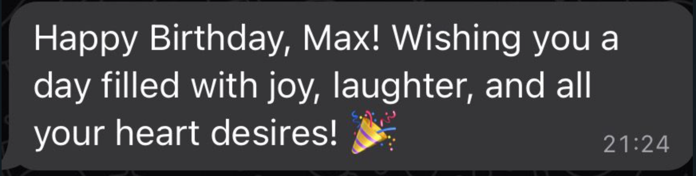
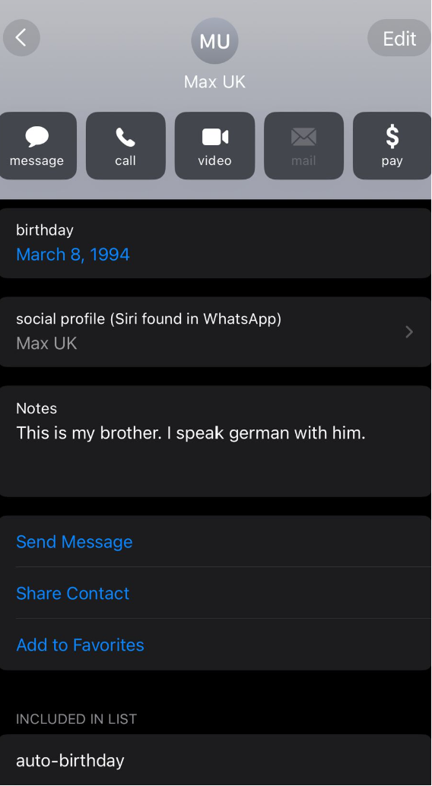
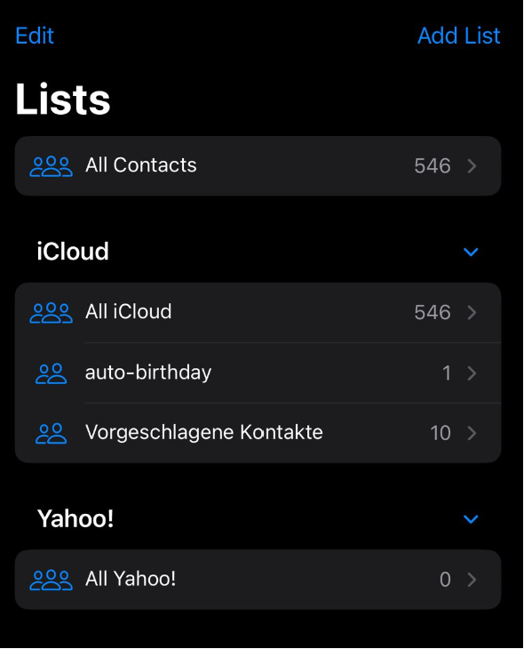
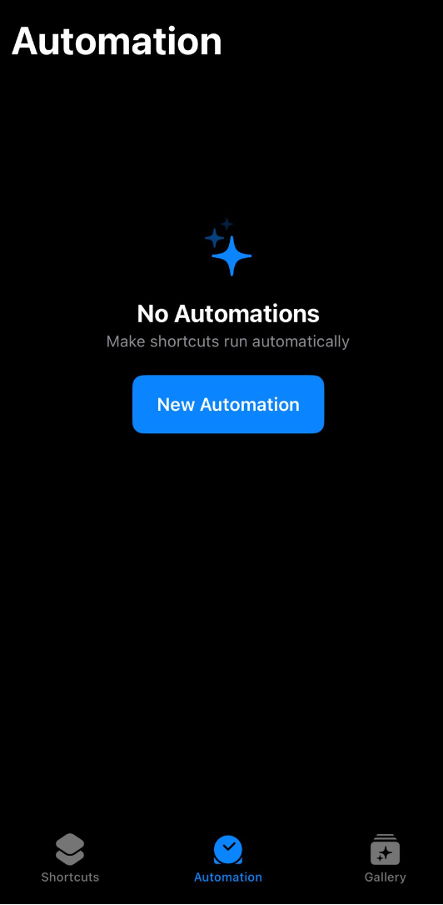
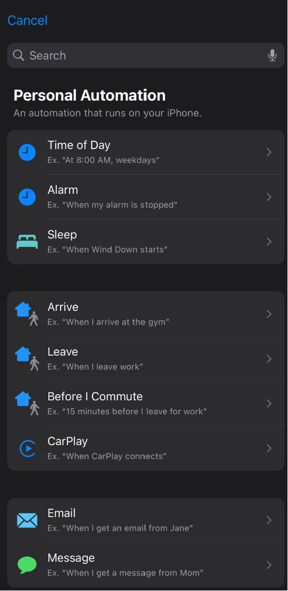
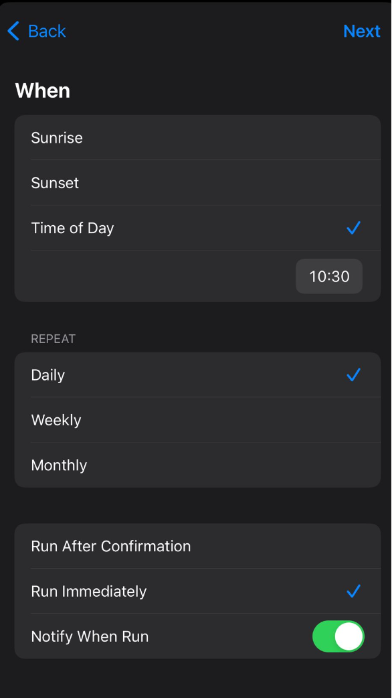
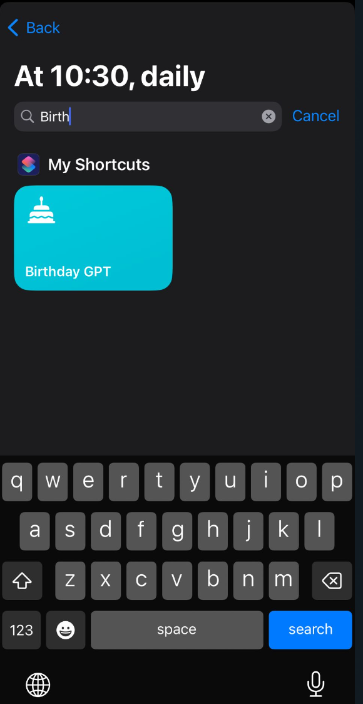

# ios-birthday-gpt-shortcut

iOS shortcut to send automated birthday whishes.

## birthday-gpt version downloads

### `v1.0.0`

[Download](https://www.icloud.com/shortcuts/23923aecc2b5486b80d94ad097e9548e)

## what does it do?

1. looks through your calendar for todays birthdays
2. iterates through todays birthdays:
3. extracts contact from birthday event
4. if the contact with todays birthday is a member of the `auto-birthday` contact list do:
    - if the contact has NOT Notes populated do:
        - ChatGPT will generate a message based on this prompt template:

            ```
            Write a two line happy birthday message to: {{First Name}}.
            Directly address the recipient. Use one birhday emoji.
            ```
    - if the contact has Notes populated do:
      - ChatGPT will generate a message based on this prompt template:
 
            ```
            Write a two line happy birthday message to {{First Name}}.
            Directly address teh recipient. Use one birthday emoji.
            Consider teh following notes about the recipient: {{Notes}}. 
            ```
5. sent generated message to the contact via WhatsApp
6. repeat steps 3-5 for rest of birthdays in todays list

## sample outputs

### `Default - no contact Notes set`
 
<br>
<p align="center">
  
</p>

### `Contact note set - "This is my brother. I speak german with him"`
 
<br>
<p align="center">
  
</p>

## dependencies

1. [Shortcuts](https://apps.apple.com/us/app/shortcuts/id1462947752)
2. [WhatsApp](https://apps.apple.com/gb/app/whatsapp-messenger/id310633997)
3. [ChatGPT - free version (gpt 3.5 turbo)](https://apps.apple.com/gb/app/chatgpt/id6448311069)

## configuration

- Populate the birthday field in your Contacts app
- Optional: populate a custom note to some of your contacts

<br>
<p align="center">
  
</p>

- Create a `auto-birthday` contact list:
    - Go to your Contacts app
    - Click on `Lists` in the upper left corner
    - Click on `Add List` in the uppoer right corner
    - Add the list `auto-birthday`
 
<br>
<p align="center">
  
</p>

## fully automate runs

You can fully automate this process via Shortcuts Automation
- go to the Shortcuts app
- click on Automation on the bottom menu
- click on New Automation
- select Time of Day
    - select an appropriate time within the Time of Day field
    - set Repeat to Daily
    - set Run Immediately - enable Notify When Run
    - search and select Birthday GPT

<br>
<p align="center">
  
</p>

<br>
<p align="center">
  
</p>

<br>
<p align="center">
  
</p>


<br>
<p align="center">
  
</p>

## TODO

1. add support for other celebration days